### Case Técnico Itau

###### Wilson Novaes de Souza Junior

## Solução Amazônia R.C, Inc. (Protótipo)

O projeto do protótipo da solução foi desenvolvida com a utilização da Ferramenta Eclipse. Abaixo segue a hierarquia de arquivos utilizada para o mesmo. A classe principal que comanda a solução é a `ClassePrincipal.java`.

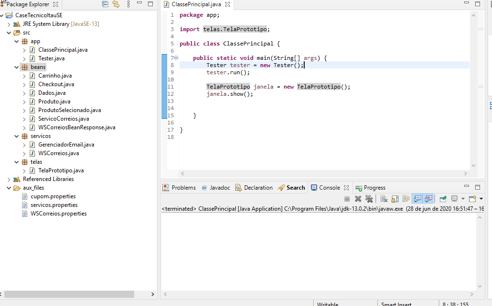

Ela possui a execução de dois métodos, oriundos de objetos diferentes, tal que a execução do `tester.run()` executa a solução com um fluxo basico de compra, inserindo produtos e informações ficiticias com o inuito de uma execução bem sucedida do processo.

Na execução do método `janela.show()`, ele abre a janela do protótipo, do qual é possivel simular um cenário de compra de produto e suas funcionalidades essenciais.

Durante a execução, é possivel visualizar as mensagens nos logs, indicando o funcionamento da solução e o processo do qual foi ou está sendo executado.

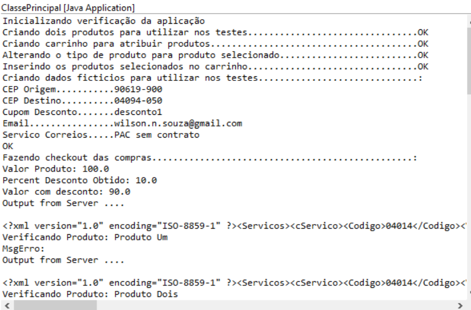

A janela do protótipo da solução possui algumas funcionalidades básicas, como a seleção do produto, inclusão no carrinho de compras, opção de receber em formato digital, etc., para que seja possivel uma interação com usuário na demonstração do protótipo.

A aba Produtos mostra uma lista de produtos que podem ser adicionados no carrinho e exibe as informações cadastradas do mesmo (objeto).

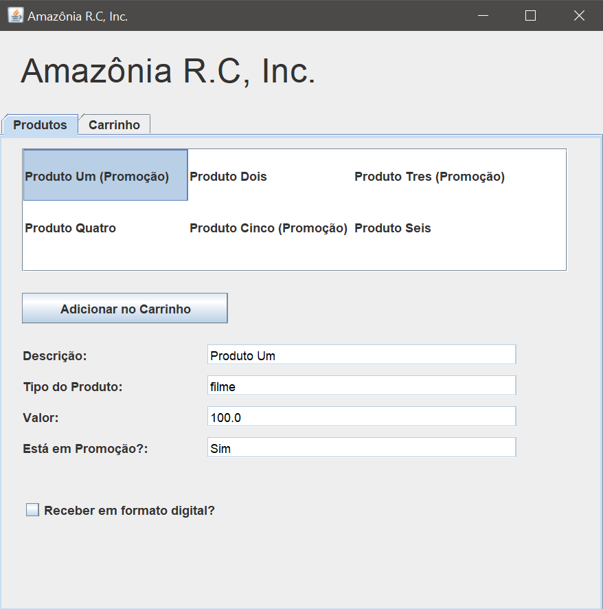

Os produtos estão inseridos através de um trecho de código presente na classe `Produtos.java` através do método:

```java
public static DefaultListModel<Produto> carregaProdutosExemplosTela() {
//...
}
```

Também seria viável a extração desses dados por meio de um arquivo ou uma base de dados.

Os produtos que estão em promoção, são demonstrados na lista de seleção de acordo com determinada propriedade no objeto.

Na aba carrinho, pode-se visualizar todos os items do qual selecionou na aba anterior, assim como removê-los ou limpar a lista por inteira.

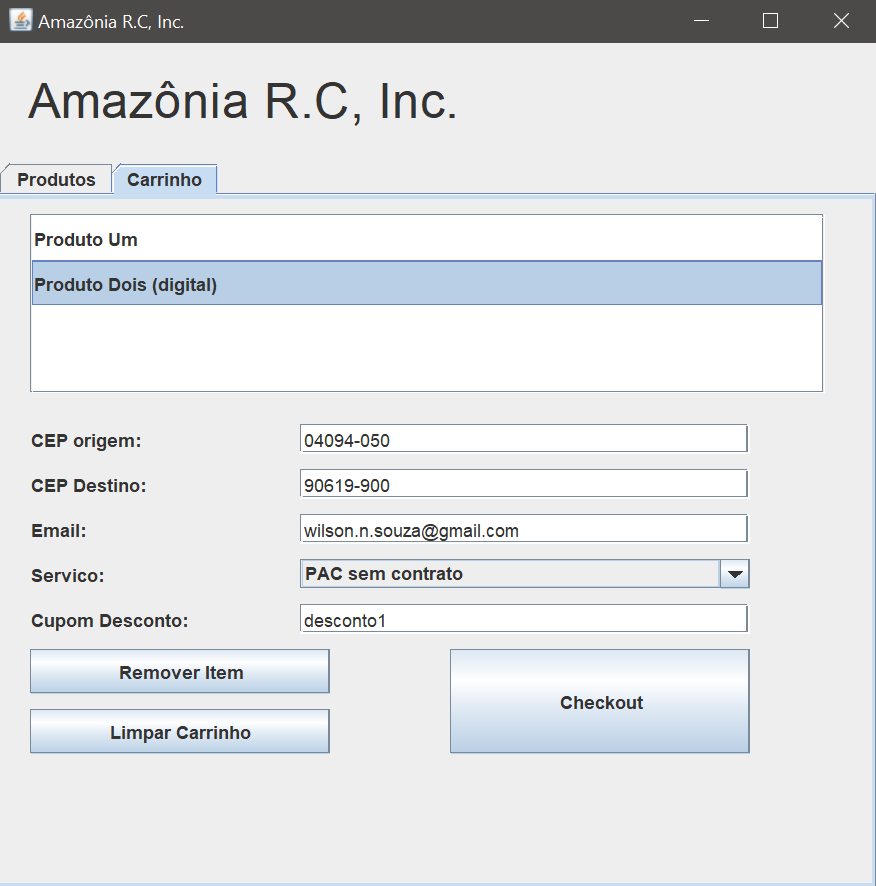

Os campos de CEP e serviço são utilizados para alimentar a request do Web Service dos Correios, fornecidos, e assim adquirir as informações de retorno do mesmo, tal como o frete. 

O de email é utilzado para envio de email após confirmação de compra, gerenciado pela classe `GerenciadorEmail.java`que está presente na solução. Para este, foi utilizado um modelo de envio utilizando o servidor do Gmail e uma conta ficiticia para teste.

Relacionado ao Cupom Desconto, a solução protótipo atual busca a informação em um arquivo chamada `cupom.properties` dentro da pasta *aux_files*, que busca o código de cupom e o desconto atribuído ao mesmo. Seria viável também a utilização de outros tipos de arquivos, caso existir a necessidade.

Após seleção dos produtos e campos preenchidos com valores válidos, é possivel realizar o checkout do carrinho antes de finalizar a suposta compra.

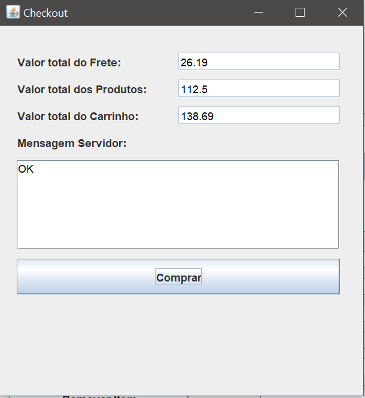


Será exibida uma janela contendo as informações já calculadas do frete, dos produtos e do valor total do carrinho (produtos + frete). O campo de texto Mensagem Servidor serve para mostrar retorno em caso de erros durante a verificação do frete no serviço do Correios. Com ele, é possível visualizar qual causa do erro, e efetuar a correção, caso necessário, ocmo valor do produto, serviço selecionado, entre outros.

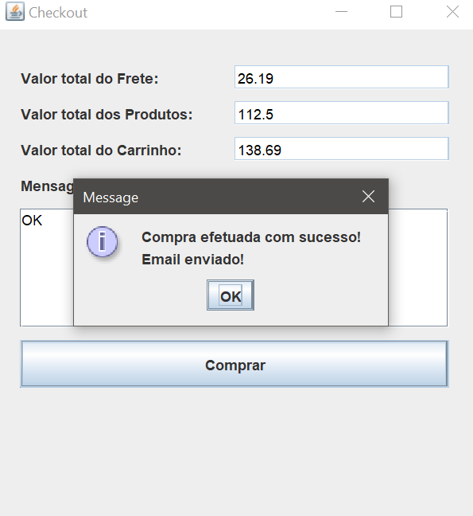

Confirmando a compra, será exibido um modal na tela, confirmando que o processo de envio de email foi feito, assim como um processamento de uma suposta compra. O email então chega na caixa de entrada do qual foi cadastrado na tela anterior.


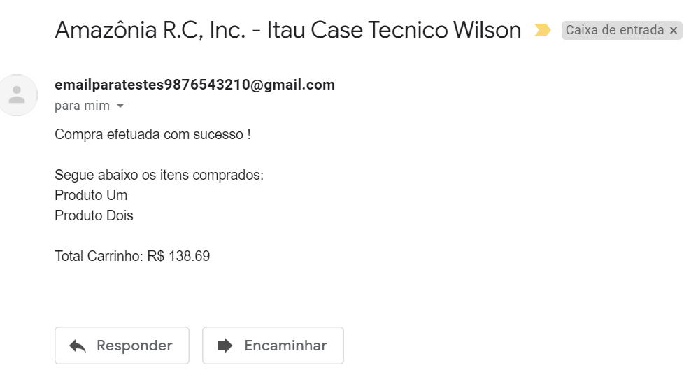

A solução possui alguns arquivos para auxiliar na tratativa de dados e valores, presentes na pasta *aux_files*.


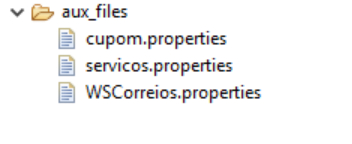

O cupom, como foi explicado anterioremente, serve para guardar os códigos dos cupons e seus repctivos descontos em porcentagem.

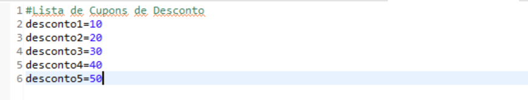

O servico consta os códigos e a descrição de cada serviço do Web Service Correios. 

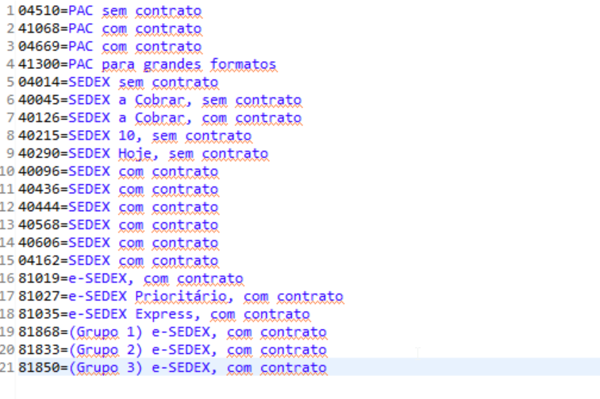

O WSCorreios contem os parametros de request padrão do Web Service do Correios. Em caso de algum campo não ser preenchido pela aplicação, ela utilizará o valor configurado nesse arquivo.

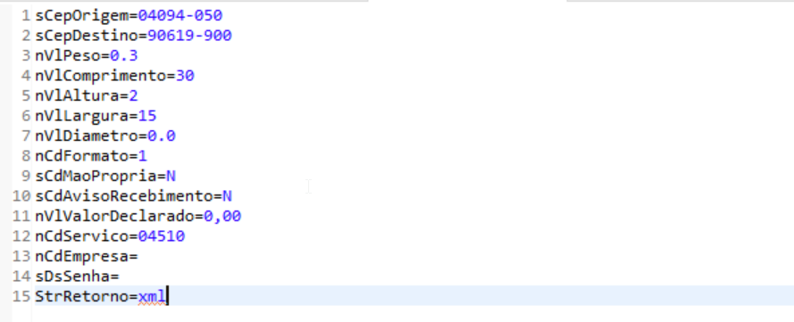
